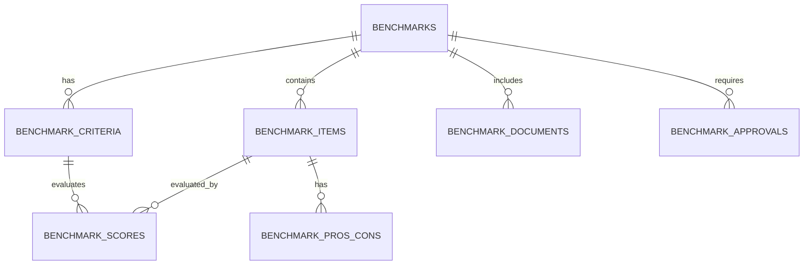

# 📊 Benchmark Yönetimi Modülü

> Ürün, süreç, teknoloji ve tedarikçi karşılaştırmalarını sistematik olarak yönetmenizi sağlayan kapsamlı analiz ve karar destek sistemi.

[](.)
[](.)
[](.)

---

## 🎯 Özellikler

### Ana Özellikler

| Özellik | Açıklama | Durum |
|---------|----------|-------|
| 📊 **Çoklu Karşılaştırma** | Sınırsız alternatif karşılaştırma | ✅ Aktif |
| ⚖️ **Ağırlıklı Skorlama** | Kriter bazlı ağırlıklı değerlendirme | ✅ Aktif |
| 👍👎 **Artı/Eksi Analizi** | Avantaj ve dezavantaj yönetimi | ✅ Aktif |
| 📁 **Doküman Yönetimi** | Kanıt dokümanları ve ekleri | ✅ Aktif |
| ✅ **Onay Akışı** | Çok seviyeli onay mekanizması | ✅ Aktif |
| 📈 **Detaylı Raporlama** | Karşılaştırma matrisi ve analiz | ✅ Aktif |
| 📄 **PDF Export** | Rapor çıktısı alma | 🔜 Planlanan |
| 📊 **Gelişmiş Grafikler** | Radar, bar, pie chart | 🔜 Planlanan |

### Desteklenen Karşılaştırma Tipleri

- ✅ **Ürün Karşılaştırma** - Farklı ürün/parça alternatifleri
- ✅ **Süreç Karşılaştırma** - İş süreçleri ve metodolojiler
- ✅ **Teknoloji Karşılaştırma** - Yazılım ve teknoloji çözümleri
- ✅ **Tedarikçi Karşılaştırma** - Tedarikçi kalite ve maliyet
- ✅ **Ekipman Karşılaştırma** - Makine ve ekipman yatırımları
- ✅ **Malzeme Karşılaştırma** - Hammadde ve malzeme alternatifleri

---

## 📦 Kurulum

### Hızlı Kurulum (10 dakika)

```bash
# 1. SQL migration çalıştır
./run-benchmark-migration.sh

# 2. Storage bucket oluştur (Manuel - Supabase Dashboard)
# 3. Kullanıcı izinleri ayarla
```

### Detaylı Kurulum

📖 **[Hızlı Başlangıç Kılavuzu](BENCHMARK_HIZLI_BASLANGIC.md)** - Adım adım kurulum

📚 **[Detaylı Kullanım Kılavuzu](BENCHMARK_MODULU_KILAVUZU.md)** - Tüm özellikler ve kullanım

---

## 🚀 Hızlı Başlangıç

### 1. İlk Benchmark'ı Oluştur

```typescript
// Sol menüden "Benchmark Yönetimi"
// "Yeni Benchmark" butonu
{
  kategori: "Tedarikçi Karşılaştırma",
  başlık: "2024 Q4 Tedarikçi Değerlendirme",
  açıklama: "En uygun tedarikçi seçimi",
  durum: "Devam Ediyor",
  öncelik: "Yüksek"
}
```

### 2. Alternatifleri Ekle

```typescript
// "Karşılaştır" → "Alternatifler" → "Alternatif Ekle"
[
  { ad: "Tedarikçi A", fiyat: 150, kalite: 85, süre: 15 },
  { ad: "Tedarikçi B", fiyat: 140, kalite: 90, süre: 20 },
  { ad: "Tedarikçi C", fiyat: 145, kalite: 88, süre: 18 }
]
```

### 3. Kriterleri Belirle

```typescript
// "Kriterler" → "Kriter Ekle"
[
  { ad: "Fiyat", ağırlık: 40 },
  { ad: "Kalite", ağırlık: 35 },
  { ad: "Teslimat", ağırlık: 15 },
  { ad: "Referanslar", ağırlık: 10 }
]
```

### 4. Skorla ve Analiz Et

```typescript
// "Karşılaştırma Matrisi" → Her hücreye 0-100 puan
// "Analiz & Sonuçlar" → Otomatik sıralama ve sonuç
```

---

## 📊 Kullanım Örnekleri

### Örnek 1: Tedarikçi Seçimi

**Senaryo:** Yeni sac tedarikçisi arayışı

**Adımlar:**
1. Benchmark oluştur (Kategori: Tedarikçi)
2. 3 tedarikçi alternatifi ekle
3. Fiyat, kalite, teslimat, referans kriterlerini tanımla
4. Teklif dokümanlarını yükle
5. Skorlama yap
6. En yüksek skorlu tedarikçiyi seç

**Sonuç:** %23 maliyet tasarrufu + daha yüksek kalite

### Örnek 2: Teknoloji Yatırımı

**Senaryo:** ERP sistemi seçimi

**Adımlar:**
1. Benchmark oluştur (Kategori: Teknoloji)
2. 4 yazılım alternatifi ekle
3. 8 kriter belirle (maliyet, özellikler, entegrasyon, destek)
4. Demo raporlarını ve teknik dokümanları yükle
5. IT ekibinden skorlar topla
6. ROI analizi yap

**Sonuç:** En uygun yazılım seçimi, 3 yıllık yatırım planı

### Örnek 3: Süreç İyileştirme

**Senaryo:** Üretim hattı optimizasyonu

**Adımlar:**
1. Benchmark oluştur (Kategori: Süreç)
2. Mevcut süreç + 2 iyileştirme alternatifi
3. Çevrim, hata, maliyet, kalite kriterleri
4. Pilot test sonuçlarını kaydet
5. İş akış şemalarını ekle
6. Karşılaştırma yap

**Sonuç:** %15 çevrim süresi düşüşü, %30 hata azalması

---

## 🗂️ Proje Yapısı

```
src/components/benchmark/
├── BenchmarkModule.jsx          # Ana modül bileşeni
├── BenchmarkForm.jsx            # Benchmark oluşturma/düzenleme formu
├── BenchmarkDetail.jsx          # Detay görünümü
├── BenchmarkComparison.jsx      # Karşılaştırma ve analiz
└── BenchmarkFilters.jsx         # Filtreleme bileşeni

scripts/
└── create-benchmark-module.sql  # Veritabanı migration

docs/
├── BENCHMARK_HIZLI_BASLANGIC.md # Hızlı başlangıç kılavuzu
├── BENCHMARK_MODULU_KILAVUZU.md # Detaylı kullanım kılavuzu
└── BENCHMARK_README.md          # Bu dosya
```

---

## 🔧 Teknik Detaylar

### Teknoloji Stack

| Katman | Teknoloji | Versiyon |
|--------|-----------|----------|
| **Frontend** | React | 18.x |
| **UI Framework** | Tailwind CSS + shadcn/ui | Latest |
| **Backend** | Supabase | Latest |
| **Database** | PostgreSQL | 15.x |
| **Storage** | Supabase Storage | Latest |
| **Animation** | Framer Motion | 10.x |

### Veritabanı Şeması



### API Endpoints

```typescript
// Benchmark CRUD
GET    /benchmarks                    // Liste
GET    /benchmarks/:id                // Detay
POST   /benchmarks                    // Oluştur
PATCH  /benchmarks/:id                // Güncelle
DELETE /benchmarks/:id                // Sil

// Alternatifler
GET    /benchmark_items?benchmark_id=eq.{id}
POST   /benchmark_items
PATCH  /benchmark_items/:id
DELETE /benchmark_items/:id

// Kriterler
GET    /benchmark_criteria?benchmark_id=eq.{id}
POST   /benchmark_criteria
PATCH  /benchmark_criteria/:id

// Skorlar
GET    /benchmark_scores?benchmark_item_id=eq.{id}
POST   /benchmark_scores
PATCH  /benchmark_scores/:id

// Dokümanlar
GET    /benchmark_documents?benchmark_id=eq.{id}
POST   /benchmark_documents
DELETE /benchmark_documents/:id

// RPC Fonksiyonlar
POST   /rpc/generate_benchmark_number
POST   /rpc/generate_benchmark_report_number
```

---

## 📈 Performans

### Optimizasyonlar

- ✅ Tüm foreign key'lerde indeks
- ✅ Tarih ve durum alanlarında indeks
- ✅ JSONB kolonları için optimize edilmiş sorgular
- ✅ Row Level Security ile güvenli erişim
- ✅ Connection pooling (Supabase)

### Ölçeklenebilirlik

| Metrik | Değer |
|--------|-------|
| Max Benchmark Sayısı | Sınırsız |
| Max Alternatif/Benchmark | Sınırsız (önerilen: 10) |
| Max Kriter/Benchmark | Sınırsız (önerilen: 10) |
| Max Doküman Boyutu | 10 MB |
| Eş Zamanlı Kullanıcı | 100+ |

---

## 🔒 Güvenlik

### Güvenlik Özellikleri

- ✅ **Row Level Security (RLS):** Tüm tablolarda aktif
- ✅ **Authenticated Access:** Sadece giriş yapmış kullanıcılar
- ✅ **Private Storage:** Dokümanlar özel bucket'ta
- ✅ **Audit Log:** Tüm işlemler kayıt altında
- ✅ **SQL Injection Koruması:** Parameterized queries

### İzin Yönetimi

```typescript
// Kullanıcı izinleri (profiles tablosu)
{
  permissions: {
    benchmark: "full"    // Tam erişim
    // veya
    benchmark: "read"    // Sadece okuma
    // veya
    benchmark: "none"    // Erişim yok
  }
}
```

---

## 🧪 Test

### Unit Tests

```bash
# Test çalıştır
npm test src/components/benchmark/

# Coverage raporu
npm test -- --coverage
```

### Integration Tests

```bash
# E2E testler
npm run test:e2e benchmark
```

### Manuel Test Checklist

- [ ] Benchmark oluşturma
- [ ] Alternatif ekleme/düzenleme
- [ ] Kriter ekleme/düzenleme
- [ ] Skorlama matrisi
- [ ] Avantaj/dezavantaj ekleme
- [ ] Doküman yükleme
- [ ] Onay akışı
- [ ] Filtreleme ve arama
- [ ] Sıralama
- [ ] Silme işlemleri

---

## 📚 Dokümantasyon

### Kullanıcı Kılavuzları

- 📖 [Hızlı Başlangıç](BENCHMARK_HIZLI_BASLANGIC.md) - 10 dakikada başlayın
- 📚 [Detaylı Kılavuz](BENCHMARK_MODULU_KILAVUZU.md) - Tüm özellikler
- 🎥 Video Eğitimler (Yakında)

### Geliştirici Dokümantasyonu

- 🔧 API Reference (Bu dosya)
- 🗄️ Database Schema (create-benchmark-module.sql)
- 🎨 Component Documentation (JSDoc comments)

---

## 🛠️ Sorun Giderme

### Sık Karşılaşılan Sorunlar

**❓ Modül görünmüyor**
```bash
# Çözüm: Kullanıcı izinlerini kontrol edin
# profiles tablosunda permissions.benchmark alanı olmalı
```

**❓ Doküman yüklenmiyor**
```bash
# Çözüm: Storage bucket ve politikaları kontrol edin
# Supabase Dashboard > Storage > benchmark_documents
```

**❓ Skorlar hesaplanmıyor**
```bash
# Çözüm: En az 1 kriter eklendiğinden emin olun
# Kriter ağırlıkları pozitif sayı olmalı
```

**❓ Migration başarısız**
```bash
# Çözüm: SQL dosyasını doğrudan Supabase SQL Editor'de çalıştırın
# scripts/create-benchmark-module.sql
```

### Debug Modu

```typescript
// Chrome DevTools Console'da
localStorage.setItem('DEBUG_BENCHMARK', 'true');
```

---

## 🔄 Güncellemeler

### Versiyon Geçmişi

#### v1.0.0 (5 Kasım 2024)
- ✨ İlk sürüm
- ✅ Temel benchmark yönetimi
- ✅ Alternatif ve kriter yönetimi
- ✅ Karşılaştırma matrisi
- ✅ Avantaj/dezavantaj analizi
- ✅ Doküman yönetimi
- ✅ Onay akışı

### Yaklaşan Özellikler

#### v1.1.0 (Planlanan: Aralık 2024)
- [ ] PDF rapor üretimi
- [ ] Grafik görselleştirmeler (Radar, Bar, Pie)
- [ ] Excel export
- [ ] Email bildirimleri

#### v1.2.0 (Planlanan: Q1 2025)
- [ ] ROI hesaplayıcı
- [ ] Şablon sistemi
- [ ] Dashboard widget'ları
- [ ] Toplu işlemler

---

## 🤝 Katkıda Bulunma

### Geliştirme Süreci

1. Feature branch oluştur (`feature/benchmark-yeni-ozellik`)
2. Değişiklikleri commit et
3. Test yaz ve çalıştır
4. Pull request aç
5. Code review bekle
6. Merge

### Kod Standartları

- ✅ ESLint kurallarına uy
- ✅ PropTypes tanımla
- ✅ JSDoc yorumları ekle
- ✅ Test coverage %80+
- ✅ Accessibility standartlarına uy

---

## 📞 Destek

### İletişim Kanalları

- 📧 **Email:** destek@kademe.com.tr
- 📱 **Telefon:** +90 XXX XXX XX XX
- 💬 **Sistem İçi Destek:** Görev oluştur
- 🐛 **Bug Report:** GitHub Issues (internal)

### Çalışma Saatleri

- Pazartesi - Cuma: 09:00 - 18:00
- Acil Destek: 7/24 (Kritik sorunlar için)

---

## 📄 Lisans

Bu yazılım Kademe A.Ş. mülkiyetindedir. 
Tüm hakları saklıdır © 2024 Kademe A.Ş.

---

## 🙏 Teşekkürler

Bu modülün geliştirilmesinde katkıda bulunan herkese teşekkürler:

- 👥 Kademe Kalite Ekibi
- 🎨 UI/UX Tasarım Ekibi
- 💻 Geliştirme Ekibi
- 🧪 Test Ekibi
- 📚 Dokümantasyon Ekibi

---

**🚀 İyi Çalışmalar!**

*Son Güncelleme: 5 Kasım 2024*

